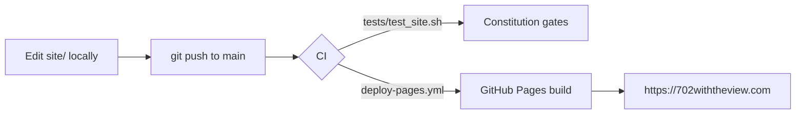

# 702 with the View

<!-- CONSTITUTION_START -->
[](https://github.com/esanacore/engineering-constitution)
<!-- CONSTITUTION_END -->

Current version: **1.5.0** · Live at **[702withtheview.com](https://702withtheview.com)**

The listing website for **702 with the View** — an apartment for rent with an
all-new GE Appliances kitchen (including a French-door refrigerator whose
icemaker runs off a filtered cold-water line) and a completely remodeled
bathroom (smart medicine cabinet with defogger, lighting, shelving, and
outlet/USB power; a fan with built-in lighting and a Bluetooth speaker).

The site is dependency-free static HTML/CSS/JS, published straight from this
repository: **every push to `main` deploys automatically to GitHub Pages**
at `702withtheview.com` (domain names cannot contain underscores, so the
repo name and domain differ deliberately — see `docs/DOMAIN_SETUP.md`).

## Getting Started

No build step, no packages. Clone and open:

```bash
git clone --recurse-submodules https://github.com/esanacore/702_with_the_view.git
```

## Run

Open `site/index.html` in a browser, or serve the directory:

```bash
python -m http.server 8000 --directory site
```

## Test

```bash
bash tests/test_site.sh
```

That runs all four suites in order:

| Suite | What it checks | In CI? |
| --- | --- | --- |
| `test_site.sh` (`T-xxx`) | Structure: sections, feature copy, photo slots, no external dependencies | Yes — gates every deploy |
| `test_layout.sh` (`L-xxx`) | Real geometry in a browser: photos contained, captions visible, no horizontal scroll (desktop + mobile × light + dark) | Skips (no browser on runners) |
| `test_interactions.sh` (`I-xxx`) | Behavior: theme toggle, photo loading, reveal, scrollspy, lightbox | Skips |
| `test_coverage.sh` | **Measured** coverage of `site/app.js` — fails below 100% line and block | Skips |

The browser suites need the local gstack browse/Playwright install; they
skip cleanly when it's missing, so the structural suite is what CI enforces.

## Project Structure

```text
702_with_the_view/
├── site/                 ← The website (what GitHub Pages publishes)
│   ├── index.html        ← Single-page listing
│   ├── styles.css        ← All styling (no frameworks)
│   ├── app.js            ← Theme toggle, photo auto-loader, scroll-reveal, scrollspy
│   └── assets/photos/    ← Photo drop zone (drop <slot>.jpg — see its README)
├── tests/
│   ├── test_site.sh          ← Structural suite + runner for the three below
│   ├── test_layout.sh        ← Browser layout regression suite
│   ├── test_interactions.sh  ← Browser behavior suite (all app.js paths)
│   ├── test_coverage.sh      ← Measured 100% coverage gate
│   └── coverage.js           ← V8 profiler harness behind that gate
├── docs/                 ← Governance + project docs
│   ├── PROPERTY_MANUAL.md ← Resident guide: appliances, models, how-tos (in progress)
│   ├── DOMAIN_SETUP.md   ← Buying 702withtheview.com and pointing DNS at Pages
│   ├── ARCHITECTURE.md   ← Layers and structure
│   └── ...               ← Constitution-required docs (requirements, test plan, ADRs…)
├── .github/workflows/    ← Pages deploy + constitution CI gates
├── constitution/         ← Eric's Engineering Constitution (git submodule)
├── TODO.md               ← Living roadmap
└── CHANGELOG.md          ← User-facing changes
```

## Updating the Site (owner cheat-sheet)

Every update is: edit → `git add -A && git commit -m "..." && git push`.
The push deploys automatically (tests run first; a bad change never
replaces the live site).

| To change…      | Do this |
| --------------- | ------- |
| **Photos**      | Drop/overwrite `site/assets/photos/<slot>.jpg` (names in that folder's README). No HTML edits — slots auto-fill. |
| **Rent / availability / facts** | Edit the `<dl class="facts">` block in `site/index.html` (search for `TBD`). |
| **Any copy**    | Edit `site/index.html` — it's plain HTML, headings and paragraphs. |
| **Appliance models & manuals** | `docs/PROPERTY_MANUAL.md` (not page copy). |

Preview locally before pushing: `python -m http.server 8000 --directory site`
→ http://localhost:8000.

## How Publishing Works



Push to `main` → the deploy workflow runs the test suite, uploads `site/` as
the Pages artifact, and publishes. Nothing else to remember.

## Documentation

- Property manual (appliances, model numbers, how-tos): `docs/PROPERTY_MANUAL.md`
- Domain purchase & DNS: `docs/DOMAIN_SETUP.md`
- Roadmap: `TODO.md`
- Changelog: `CHANGELOG.md`
- Architecture decisions: `docs/adr/`
- Operations runbook: `docs/OPERATIONS.md`
- Product requirements: `docs/PRODUCT_REQUIREMENTS.md`

## Contributing

Before completing work:

- Update tests.
- Update documentation.
- Update TODO.md.
- Update CHANGELOG.md for user-facing changes.
- Review security impact.
