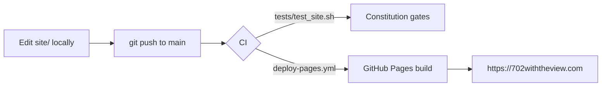

# 702 with the View

<!-- CONSTITUTION_START -->
[](https://github.com/esanacore/engineering-constitution)
<!-- CONSTITUTION_END -->

The listing website for **702 with the View** — an apartment for rent with an
all-new GE Appliances kitchen (including a French-door refrigerator whose
icemaker runs off a filtered cold-water line) and a completely remodeled
bathroom (smart medicine cabinet with defogger, lighting, shelving, and
outlet/USB power; a fan with built-in lighting and a Bluetooth speaker).

The site is dependency-free static HTML/CSS/JS, published straight from this
repository: **every push to `main` deploys automatically to GitHub Pages**.
The production domain will be `702withtheview.com` (domain names cannot
contain underscores, so the repo name and domain differ deliberately —
see `docs/DOMAIN_SETUP.md`).

## Getting Started

No build step, no packages. Clone and open:

```bash
git clone --recurse-submodules https://github.com/esanacore/702_with_the_view.git
```

## Run

Open `site/index.html` in a browser, or serve the directory:

```bash
python -m http.server 8000 --directory site
```

## Test

```bash
bash tests/test_site.sh
```

The suite runs structural assertions against the site (sections present,
feature copy intact, placeholders wired, no external dependencies). It also
runs in CI before every deploy.

## Project Structure

```text
702_with_the_view/
├── site/                 ← The website (what GitHub Pages publishes)
│   ├── index.html        ← Single-page listing
│   ├── styles.css        ← All styling (no frameworks)
│   ├── app.js            ← Scroll-reveal, scrollspy, day/dusk hero toggle
│   └── assets/photos/    ← Photo drop zone (placeholders for now; see its README)
├── tests/
│   └── test_site.sh      ← Structural test suite (runs locally and in CI)
├── docs/                 ← Governance + project docs
│   ├── PROPERTY_MANUAL.md ← Resident guide: appliances, models, how-tos (in progress)
│   ├── DOMAIN_SETUP.md   ← Buying 702withtheview.com and pointing DNS at Pages
│   ├── ARCHITECTURE.md   ← Layers and structure
│   └── ...               ← Constitution-required docs (requirements, test plan, ADRs…)
├── .github/workflows/    ← Pages deploy + constitution CI gates
├── constitution/         ← Eric's Engineering Constitution (git submodule)
├── TODO.md               ← Living roadmap
└── CHANGELOG.md          ← User-facing changes
```

## How Publishing Works



Push to `main` → the deploy workflow runs the test suite, uploads `site/` as
the Pages artifact, and publishes. Nothing else to remember.

## Documentation

- Property manual (appliances, model numbers, how-tos): `docs/PROPERTY_MANUAL.md`
- Domain purchase & DNS: `docs/DOMAIN_SETUP.md`
- Roadmap: `TODO.md`
- Changelog: `CHANGELOG.md`
- Architecture decisions: `docs/adr/`
- Operations runbook: `docs/OPERATIONS.md`
- Product requirements: `docs/PRODUCT_REQUIREMENTS.md`

## Contributing

Before completing work:

- Update tests.
- Update documentation.
- Update TODO.md.
- Update CHANGELOG.md for user-facing changes.
- Review security impact.
