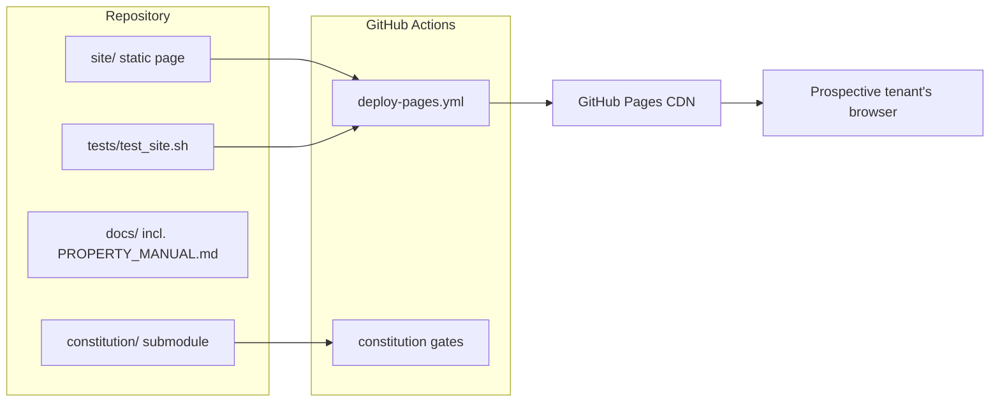

# Architecture

This document provides a high-level overview of how this project is wired and organized.

## System Overview

A dependency-free static website for a rental listing. There is no backend,
no database, and no build step: `site/` is the deployable artifact exactly
as committed. GitHub Pages serves it; GitHub Actions is the only
"infrastructure", running tests and publishing on every push to `main`.

## Component Diagram

## Data Flow

Content flows one way: owner edits `site/` → push to `main` → CI tests →
Pages deploy → browser. The page collects no data; the only outbound action
is a `mailto:` link. The day/dusk toggle and scroll effects are client-side
state only, held in the DOM.

## Key Technologies

- **Frontend**: hand-written HTML5, CSS (custom properties, grid,
  IntersectionObserver-driven reveals), vanilla JS. No frameworks, no
  external fonts or CDNs.
- **Backend**: none.
- **Infrastructure**: GitHub Pages (hosting + TLS), GitHub Actions
  (test-gated deploys), Cloudflare (registrar + DNS for `702withtheview.com`).

## Repository Structure

- `site/`: the website — the deployable artifact.
- `tests/`: structural test suite (`test_site.sh`).
- `docs/`: governance docs, the Property Manual, and the domain guide.
- `constitution/`: universal engineering rules (git submodule).

## Layer Boundaries

The site is a single static layer with no internal imports (one HTML page
referencing one stylesheet and one script), so there is no dependency graph
to declare — the table below intentionally stays a single layer. If the
project ever grows modules (e.g. a JS bundle with imports), declare real
layers here and tighten the constitution-architecture workflow to `--strict`.

| Layer | Path | May Depend On |
| ----- | ---- | ------------- |
| site  | site | --            |
